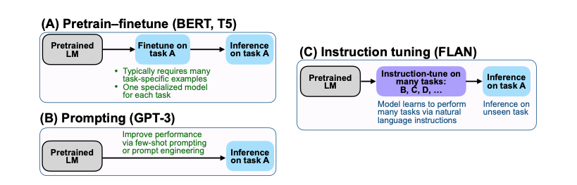

# A Survey on Multimodal Large Language Models

 

## Description

### Summary

* ChatGPT the GOAT
* 멀티모달-LLM에 대한 서베이 논문
* 깃허브에 선별된 논문들 및 데이터 / 벤치마크가 올라와있습니다 :thumbsup:츄라이
* 학습 안하는 논문은 대체로 ChatGPT(3.5, 4) / GPT3을 사용(메타는 라마70B)
  * 학습논문도 데이터 만드는데는 다 ChatGPT(3.5, 4)를 사용. 최신논문은 다 4인데 이미지 사용 인퍼런스라 돈이 엄청 들었을 것으로 추정...
* Vision embedding에서는 ViT를 대부분 쓰네요.

***

## Introduction

#### 멀티모달을 쓰면 좋은 점?

> 사람은 시각, 청각을 같이 활용하여 이해하기 때문에 사람과 더 유사한 사고를 할 수 있습니다. 또한, 사용 시 보다 높은 자유도를 제공하며, 더 많은 문제를 해결할 수 있습니다.

#### 기존의 멀티모달 모델과의 비교

과거 논문([https://arxiv.org/pdf/1707.07998.pdf](https://arxiv.org/pdf/1707.07998.pdf))을 참고하면, 기존 멀티모달 모델은 이미지 임베딩과 텍스트 임베딩을 가지고 attention을 구해 정답 단어를 구하는 형식을 가지고 있다.

현재 멀티모달 구조도 이와 유사하게 이미지 임베딩과 텍스트 임베딩을 가지고 답변을 생성함. 그러나 답변 생성 시 더 길고 자세한 답변을 생성할 수 있고 reasoning이 가능하다는 차이점이 있다. 이는 언어 모델의 변화로 인해 답변이 생성형으로 변했다는 점과, 이미지 모델과 언어 모델의 급격한 성능 향상에 기인한다. ChatGPT 등장

#### 이 논문이 다루는 범위

* Multimodal LLM이므로 텍스트 반드시 포함
* Multimodal은 이미지, 음성, 비디오 등이 포함
* 응답이 텍스트
* LLM이 베이스 - 비전 모델 베이스인데 텍스트도 이해할 수 있습니다! 는 제외
* Task Finetuning은 제외했음 (밑의 이미지)

<figure><figcaption></figcaption></figure>

이 논문에서는 정말 큰 가지만을 설명하고 있고, 자세한 implementation detail에 대해서는 다루고 있지 않음(주로 어떤 모델을 쓰는지?) 각각의 논문에 대해 많이 설명하고 있지도 않음............

## Method

### Multimodal Instruction Tuning (M-IT)

#### Instruction Tuning

* 지시 - 응답 의 형식으로 된 데이터를 기반 모델(PLM)에 학습시킴.
  * PLM의 경우 단순히 '다음 단어 생성'을 목적으로 하기 때문에 그냥 텍스트 데이터를 포맷없이 집어넣는 느낌. 따라서 질문을 입력으로 주면 이상한 말을 할 수도 있음 `오늘 점심 뭐야 -> 오늘 점심 뭐야 오늘 저녁 뭐야 내일 점심 뭐야 내일 저녁 뭐야...`
  * Instruction 데이터는 지시-응답 형식으로 되어 있으며, 일반적으로 특정 포맷에 맞춰서 학습시키기 때문에 모델이 아! 나 대답할차례 하고 대답함.&#x20;
    * 모르는 지시문이 나오면 PLM처럼 또 뻘짓함. 따라서 지시문의 **양이 많고, 종류가 많고, 답변도 상세하고 지시를 잘 따를수록** 좋은 데이터.

#### Multimodal Instruction Tuning

지시-응답 중 '지시' 부분에 멀티모달 데이터가 같이 들어감.&#x20;

> <귀여운 고양이 사진>얘 이름지어줘 -> 발꾸락이 하얀 걸 보니 양말을 신은 것 같네요. '양말이' 어떨까요?
>
> <게임 동영상>몇번죽었음? -> 1:10, 1:14, 1:15, 1:16, 2:21, 2:35, 3:46, 3:47, 5:55, 5:56, 6:01, 6:02, 6:04에서 죽었으니 총 13번 죽었네요!

멀티모달 튜닝에서 중요한 것은 다음 두 가지라고 볼 수 있음.

1. 어떻게 멀티모달 instruction데이터를 만들까?\
   클립이 업데이트 안 되는 걸 보면 알겠지만.... 이미지-텍스트 데이터의 수가 너무 적음. 따라서 데이터의 수를 우선적으로 늘려야 되고, instruction도 다양해야 되고, 답변 길이도 단답이 아니어야 됨!
2. 어떻게 멀티모달 정보를 언어 모델이 이해하게 할까?\
   이미지 / 음성 / 동영상 등의 feature를 언어 모델이 이해할 수 있도록 해야 한다. 가장 간단하게는 이미지 캡셔닝을 써서 이미지 -> 텍스트로 만든 다음에 언어 모델에 먹이는 것(하수)

#### 데이터를 만들어보자

벤치마크 데이터로 만들어보자

* 벤치마크 데이터는 기본적으로 품질이 어느정도 보장된다고 할 수 있어서 사용하기 좋다.
  * 이미지: 이미지+캡션 생성 / 이미지+OD로 object를 가져와서 메타데이터 만들기
  * 음성: 음성-텍스트 페어 그냥 가져다 쓰면 됨.
  * 동영샹: 프레임-음성-자막 페어를 사용해서 메타데이터 만들기. 혹은 프레임에서 위의 이미지 메타데이터를 만들어서 같이 사용하기도 한다.
* Augmentation
  * 바로 사용하기에는 멀티모달+간단한질문->단답으로 이루어져있기 때문에 약간의 트릭을 섞음 (LLaVA, MiniGPT-4, GPT4Tools, ...)
  * 단답을 보고 긴 문장을 생성하게 시키기(ChatGPT)
  * 질문 대답 둘 다 생성하게 시키기(ChatGPT)
  * 대답에 reasoning을 하게 시키기(ChatGPT)

텍스트 온리 데이터 + 멀티모달 데이터 쓰까 (LaVIN, MultiInstruct)

* 이렇게 하면 텍스트로만 질문해도 대답할 수 있게 됨.
* MultiInstruct 왈 `부분적으로 섞어도 성능이 그렇게 떨어지진 않는다.`

#### 모델이 멀티모달을 이해하게 해보자

Using Experts (VideoChat-Text)

* 데이터를 만드는 게 아니고, 생성 스텝에서 metadata를 줄 experts가 들어간다. 캡션 정보가 텍스트 생성 시 추가로 주어진다던가...
* 멀티모달 데이터가 직접적으로 언어모델에 들어가는 것이 아니라서 information loss가 발생한다.

Learnable Parameter (LLaVA, MedVIn-T, Flamingo, BLIP-2 ..)

* 이미지는 embedding이 텍스트보다 훨씬 크니까 projection layer를 만들어 학습시키자!
* 멀티모달 embedding을 이해하기 위한 추가 학습 가능 임베딩/레이어를 만들자!
* 추가 레이어 말고 그냥 적은 패러미터만 튜닝(=lora등)하면 된다! (LLaMA-Adapter, LaVIN)

### Multimodal In-Context Learning

#### In-Context Learning

* 퓨샷/제로샷을 예쁘게 쓴 말.

in-context learning에서 중요한 것은 다음 두 가지이다. 모델의 능력도 당연히 중요하지만, 애초에 모델이 구리면 ICL자체가 되지를 않으니 논외. 그래서 이 구간에서 소개된 논문들은 대부분 ChatGPT를 쓴다.

1. 샘플 퀄리티
2. 프롬프트

퓨샷은 프롬프트가 조금 구려도 샘플이 괜찮으면 잘 하는 편 / 제로샷은 프롬프트를 엄청나게 만져야 한다.&#x20;

멀티모달 임베딩 처리는 어떻게 하죠? -> 그래서 ChatGPT 씁니다.

이미지 입력 처리는 어떻게 하죠? -> 그래서 ChatGPT 씁니다.

ChatGPT 쓰기 싫어요 -> ToolFormer 로 가세요

* 길고 자세한 답변을 위해 'think frame by frame'과 같은 프롬프트 추가.
* tool usage의 경우 tool에 대한 설명 추가.

### Multimodal Chain-of-Thoughts

#### Chain-of-Thoughts

* think step by step을 기억하자.
* 단박에 답을 내리는 것이 아니라 과정을 먼저 생성하고, 답을 생성하게 한다.
* LLM은 과거의 생성 결과들을 기반으로 새로운 토큰을 생성하므로, Reasoning을 LLM의 성향에 맞게 잘 바꾼 것이라고 생각하면 된다.

#### Chain Configuration

* 무조건 N스텝의 reasoning 후 답을 낸다(CoT-PT, ..)
* 모델이 알아서 적정 스텝의 reasoning 후 답을 낸다(MM-REACT, ...)

### LLM-Aided Visual Reasoning

여기 소개되는 논문들은 모델보다는 시스템 논문에 가깝다.

약간 이런 애들 (사진은 HuggingGPT)

<figure><figcaption></figcaption></figure>

따라서 딱히 소개하지는 않겠음.

### 평가

#### Closed-Set

* 정답이 있는 데이터라는 뜻.
* ScienceQA가 가장 유명하다.

#### Open-Set

* 정답은 없다.&#x20;
* 그럼 평가를 어떻게 하죠? ChatGPT에게 야 이거 답 너보다 낫냐? 라고 물어봄
  * 평가용 프롬프트를 어떻게 짜느냐? 에 대한 논문들이 있음.

## Discussion

* 사실 논문에서 알고 싶었던 것은 주로 어떤 모델을 사용하는가(언어모델=CausalLM인것처럼), 어떤 방식으로 학습하는가 느낌이었는데 생각보다 그 정보가 많지는 않음
* 대신 github에 논문이 많고 그걸 나눠 가며 읽을 예정
* ChatGPT를 엄청나게 쓰고 ChatGPT4를 진짜 많이 쓴다. 다들 돈이 많다.
* 대체로 LLM에 학습가능한 레이어를 붙이고 튜닝하는 방식인 듯 하다. 공개모델 퓨샷은 거의 전멸에 가까움.
* 대부분 image-text이고 간간히 video-text가 보이고 voice는 거의 없다. voice는 아웃풋이 text보다는 양방향 가능한 쪽이 수요가 많은지 여기 범위에 걸린 건 많지 않아 보임.
* 캡셔닝 안좋다는 말이 정말정말정말 많다. 되도록 임베딩을 사용할 것.

