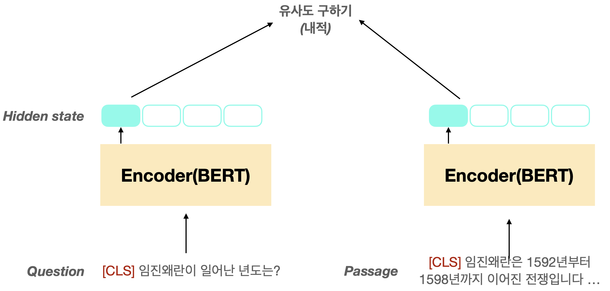

# LLaVA: Large Language and Vision Assistant

GitHub: [https://github.com/haotian-liu/LLaVA?tab=readme-ov-file](https://github.com/haotian-liu/LLaVA?tab=readme-ov-file)

데모 : [https://llava.hliu.cc/](https://llava.hliu.cc/)

<figure><figcaption>
LLaVA 데모
</figcaption></figure>

## Intro

* Microsoft Research
* 거대 Vision-Language 오픈소스 (챗봇) 모델
* 논문 제목은 Visual Instruction Tuning
  * Instruction을 GPT-4로 만들었다
* 버전 1, 1.5, 1.6 있음
  * 최신 버전일수록 더 좋은 데이터, 최적화 개선
*   상업적 이용 라이센스 확인 필요

    * LLaMA, OpenAI, ShareGPT의 라이센스를 따름
    *   ShareGPT: diffusion의 프롬프트 공유 사이트 ChatGPT 버전

        <figure><figcaption></figcaption></figure>
    * LLaMA: 월간 사용자가 7억명 이상일 경우 라이센스를 요청?

    <figure><figcaption></figcaption></figure>

## LLaVA: Visual Instruction Tuning

* text-only GPT-4로 vision-langauge instruction-following data 생성
  * Chat 가능
* End-to-end로 학습된 거대 vision-language 모델
  * Vison Encoder (OpenCLIP) + LLM (Vicuna)
  * base 모델, 모델 가장 간단한 구조 사용함
* GPT-4로 생성한 데이터, 학습된 모델, 코드 공개

### (데이터) GPT-assisted Visual Instruction Data Generation

* 기존의 image-text 데이터 사용
* text-only GPT-4 사용
  * 텍스트로 이미지 표현하기 위해 데이터셋의 caption과 bounding box 사용
  *   3 가지 종류의 instruction (158k)\
      : conversation(58k), detailed description(23k), complex reasoning(77k)

      <figure><figcaption>
instructional vision-langauge 데이터 예시
</figcaption></figure>

### (학습) Visual Instruction Tuning

#### 모델 구조

<figure><figcaption></figcaption></figure>

* $$X_v$$: 이미지, $$(X_q, X_a)$$: 텍스트 (instruction) question-answer
* $$H_v = W \cdot Z_v, \;\;with\;\; Z_v = CLIP(X_v)$$
  * $$W$$: dimension 맞춰주는 projection layer, 여기서는 linear 사용 => base 모델
  * $$Z_v$$: 이미지 grid features

#### 학습 데이터 구성

* 각 이미지에 대해 Multi-turn data 구성 $$X_v,$$$$(X_q^1, X_a^1, ..., X_q^T, X_a^T)$$
  * 첫 번째 turn에서만 이미지 정보 주도록 디자인
  *

      <figure><figcaption></figcaption></figure>

      <figure><figcaption>
Multi-turn 데이터 예제
</figcaption></figure>

#### 학습 방법

*   목적 함수 : instruction 주어졌을 때, answer와 \<STOP> 예측 (초록색 토큰)

    <figure><figcaption></figcaption></figure>
* 두 단계로 학습
  * Stage 1: Pre-training for Feature Alignment
    * Vision Encoder의 projection layer 학습
    * image-text 데이터셋의 텍스트 사용
      * $$X_q$$ : 이미지를 간단히 설명하세요
      * $$X_a$$ : ground-truth text 데이터
  * Stage 2: Fine-tuning End-to-End
    *
      Vision Encoderì˜ projection layer, LLM 학습
    * GPT-4로 생성한 instructional data 사용 => Multi-Modal Chatbot!!!!

### Limitation

* 사전 지식이 필요한 경우 ex. 다국적언어 이해, 음식 설명
* "딸기, 요거트" 와 "딸기맛 요거트" 구분하지 못함
* 단답 대답 못함&#x20;

## LLaVA 1.5: Improved Baselines with Visual Instruction Tuning

* 잘 안돼? 데이터 추가해 👊
  * 단순 응답의 VQA (Vision Question Answering) 데이터 추가
    * 질문에 단순 응답 format 추가 ex) Q: .... 한 단어로 답하시오.
  * ShareGPT 데이터 추가 => 다국적언어 이해 개선
* 잘 안돼? 크기 늘려 👊
  * LLM 7B -> 13B
  * 이미지 해상도 높임, 더 큰 CLIP Vision모델과 MLP projection 사용
    *

        <figure><figcaption></figcaption></figure>

* Limitation
  * 모델 증가한 만큼 computational cost 증가
  * 늘 그렇듯 학습하지 않은 거 여전히 못함

## LLaVA-1.6: Improved reasoning, OCR, and world knowledge

<figure><figcaption></figcaption></figure>

*   (1) Dynamic High Resolution

    * 고해상도 이미지의 효율적 처리

    <figure><figcaption></figcaption></figure>
* (2) Data Mixture
  * [LAION-GPT-V](https://huggingface.co/datasets/laion/gpt4v-dataset) and [ShareGPT-4V](https://sharegpt4v.github.io/) 사용
  * 실제 유저의 [LLaVA demo](https://llava-vl.github.io/)15K 데이터
  * 필터링 후, GPT-4V로 instructional data 생성
  * TextCaps, TextVQA 동일한 이미지 사용, TextCaps 제거
  * OCR 위해서 DocVQA, SynDog-EN 추가
  * 차트, 다이어그램 위해서 ChartQA, DVQA, AI2D 추가
*   (3) Scailing LLM Backbone

    * &#x20;[Mistral-7B](https://mistral.ai/news/announcing-mistral-7b/) and [Nous-Hermes-2-Yi-34](https://huggingface.co/NousResearch/Nous-Hermes-2-Yi-34B)테스트

    <figure><figcaption></figcaption></figure>

